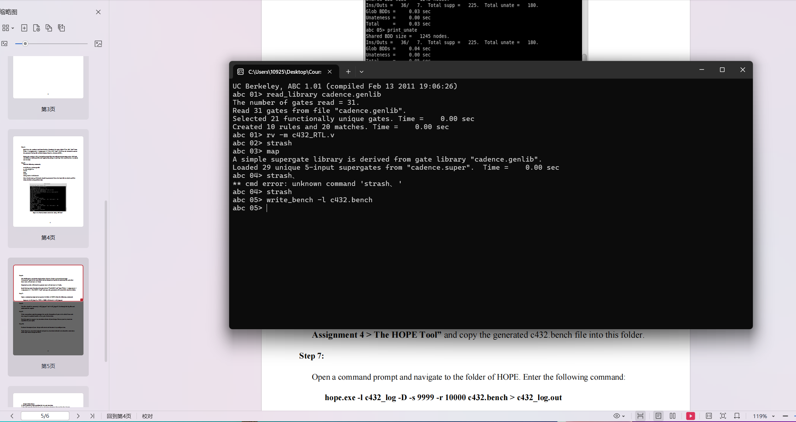
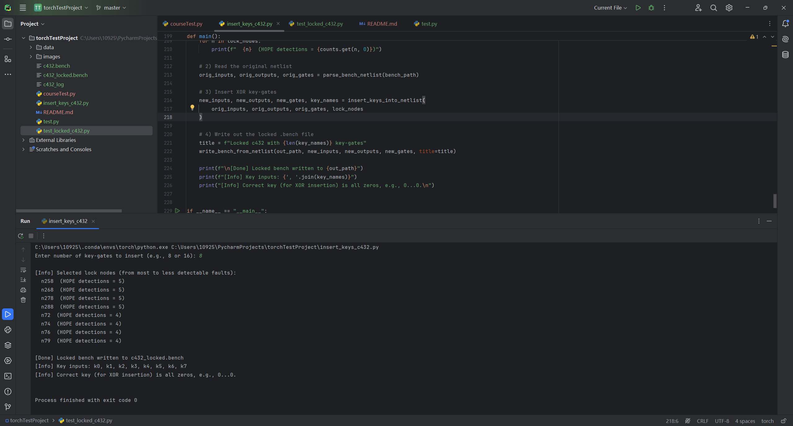
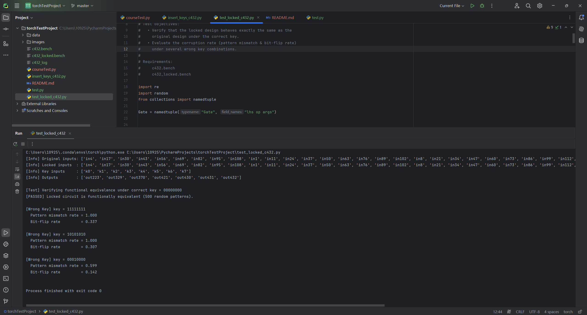

# ECGR(5090) Assignment 4 Report

## Student Information
**Name:** Yufan Liu  
**Student ID:** 801442680  

---

## GitHub Repository
[https://github.com/6yufan/ECGR-5090-Assign-4](https://github.com/6yufan/ECGR-5090-Assign-4)

---

## Part 1: Steps with Snapshots

### **1.1 Step4-5 Convert the Verilog file to Bench format**
- **Step4-5:**
 

### **1.2 Step6-8 Use HOPE Tool for fault analysis**
- **Step6-8:**
 

### **1.3 Step9 insert XOR key-gates into c432.bench**
- **Step9:**
 

### **1.4 Step10 Functional validation and security evaluation for the locked c432 circuit**
- **Step10:**
 


## Part 2: Key Insertion Scheme

### **2.1 Motivation**
Nodes with high HOPE detection counts influence many outputs. Locking these nodes ensures:
- #### Wrong key produces widespread corruption
- #### Circuit becomes unusable without correct key

### **2.2 Node Selection Policy**
We parse `c432_log` and count:
- #### Every `nXXX` appearing as a detected stuck-at fault
- #### Higher counts → higher impact → better locking candidates
We select the top **N nodes** (N chosen by user).

### **2.3 Key-Gate Structure**
For each selected node `x`:
```
x = OP(a, b, ...)
x_locked = XOR(x, k_i)
```
All downstream references to `x` become `x_locked`.

### **2.4 Correct Key**
Because XOR is used:
```
Correct key = all zeros (000...0)
```
Thus:
```
x_locked = x XOR 0 = x   → correct behavior
x_locked = x XOR 1 = ~x  → corrupted behavior
```

### **2.5 Locked BENCH Example (before/after)**
**Before:**
```
n258 = AND(n72, n94)
```
**After:**
```
n258 = AND(n72, n94)
n258_locked = XOR(n258, k0)
```
This ensures localized but propagating corruption.


## Part 3: Code Developed

### **3.1 insert_keys_c432.py**
```
# Use the HOPE c432_log results to automatically insert XOR key-gates
# into c432.bench and generate the locked netlist c432_locked.bench.
#
# Enter the number of key-gates (e.g., 8, 16) when prompted.

import re
import random
from collections import Counter, namedtuple

Gate = namedtuple("Gate", "lhs op args")


# ---------- Generic .bench parser ----------

def parse_bench_netlist(path):
    """
    Parse a .bench file into:
      - inputs:  [list of primary input names]
      - outputs: [list of primary output names]
      - gates:   list of Gate(lhs, op, args)
    """
    inputs = []
    outputs = []
    gates = []

    with open(path, "r") as f:
        for line in f:
            line = line.strip()
            if not line or line.startswith("#"):
                continue
            if line.startswith("INPUT("):
                name = line[line.find("(") + 1: line.find(")")]
                inputs.append(name)
            elif line.startswith("OUTPUT("):
                name = line[line.find("(") + 1: line.find(")")]
                outputs.append(name)
            elif "=" in line:
                lhs, rhs = line.split("=")
                lhs = lhs.strip()
                rhs = rhs.strip()
                m = re.match(r"([A-Z]+)\((.*)\)", rhs)
                if not m:
                    raise ValueError(f"Cannot parse RHS: {rhs}")
                op = m.group(1)
                args_str = m.group(2).strip()
                args = [a.strip() for a in args_str.split(",") if a.strip()]
                gates.append(Gate(lhs, op, args))
    return inputs, outputs, gates


def parse_bench_nodes(path):
    """
    Parse only the node names:
      - primary inputs
      - primary outputs
      - left-hand side (LHS) of each gate
    This is used to align node names with HOPE's log.
    """
    inputs = []
    outputs = []
    nodes = []
    with open(path, "r") as f:
        for line in f:
            line = line.strip()
            if not line or line.startswith("#"):
                continue
            if line.startswith("INPUT("):
                name = line[line.find("(") + 1: line.find(")")]
                inputs.append(name)
            elif line.startswith("OUTPUT("):
                name = line[line.find("(") + 1: line.find(")")]
                outputs.append(name)
            elif "=" in line:
                lhs = line.split("=")[0].strip()
                nodes.append(lhs)
    return inputs, outputs, nodes


# ---------- Parse HOPE log and count fault detections ----------

def parse_hope_counts_filtered(log_path, valid_names):
    """
    Parse HOPE's c432_log and count how many times each node's fault
    is detected across all test patterns.

    Only nodes in valid_names (derived from the .bench netlist:
    primary inputs, internal nodes, and primary outputs) are counted.
    """
    counts = Counter()

    with open(log_path, "r", errors="ignore") as f:
        for line in f:
            if not line.strip():
                continue
            # Lines starting with "test" are headers for each test vector; skip them.
            if line.startswith("test"):
                continue

            # Indented lines list detected faults for that test.
            if line[0].isspace():
                s = line.strip()
                token = s.split()[0]    # e.g., "n258" or "n258->n290"
                if "->" in token:
                    token = token.split("->")[0]
                token = token.strip()
                if token in valid_names:
                    counts[token] += 1

    return counts


def choose_lock_nodes(bench_path, log_path, num_keys):
    """
    Choose nodes to be locked:
      1) Collect all internal nodes from the .bench (nodes whose LHS starts with 'n').
      2) Use the HOPE log to count the number of fault detections for each node.
      3) Sort nodes by detection count in descending order and pick the top num_keys.
    """
    inputs, outputs, nodes = parse_bench_nodes(bench_path)
    valid_names = set(inputs + outputs + nodes)
    counts = parse_hope_counts_filtered(log_path, valid_names)

    internal_nodes = [n for n in nodes if n.startswith("n")]
    # Sort by HOPE detection count (nodes not present in the log are treated as 0).
    scored = sorted(internal_nodes, key=lambda n: counts.get(n, 0), reverse=True)

    if num_keys <= len(scored):
        chosen = scored[:num_keys]
    else:
        # Should not normally happen: c432 has plenty of internal nodes.
        chosen = scored

    return chosen, counts


# ---------- Insert XOR key-gates into the netlist ----------

def insert_keys_into_netlist(orig_inputs, orig_outputs, orig_gates, lock_nodes, key_prefix="k"):
    """
    Insert XOR key-gates into the netlist.

    For each lock_nodes[i] = x:
      1) Keep the original gate: x = OP(...)
      2) Immediately after it, insert: x_locked = XOR(x, k_i)
      3) In all subsequent gates, replace every occurrence of x in the RHS
         with x_locked once x has been locked.

    For XOR-based locking, the correct key is all zeros.
    """
    key_names = [f"{key_prefix}{i}" for i in range(len(lock_nodes))]
    lock_map = {node: (f"{node}_locked", key_names[i]) for i, node in enumerate(lock_nodes)}

    new_inputs = orig_inputs + key_names
    new_outputs = list(orig_outputs)
    new_gates = []
    # Tracks which nodes have already had their XOR key-gate inserted,
    # so that downstream uses can be replaced by the locked version.
    seen_locked = set()

    for g in orig_gates:
        # Replace inputs in RHS only for nodes that are already locked.
        new_args = []
        for a in g.args:
            if a in seen_locked:
                locked_name, _ = lock_map[a]
                new_args.append(locked_name)
            else:
                new_args.append(a)

        new_gates.append(Gate(g.lhs, g.op, new_args))

        # If this gate's output is one of the nodes to be locked:
        if g.lhs in lock_map:
            locked_name, key_name = lock_map[g.lhs]
            # Insert an XOR gate right after: locked = XOR(original, key)
            new_gates.append(Gate(locked_name, "XOR", [g.lhs, key_name]))
            seen_locked.add(g.lhs)

    return new_inputs, new_outputs, new_gates, key_names


def write_bench_from_netlist(path, inputs, outputs, gates, title="Locked c432"):
    """
    Write the modified netlist back to a .bench file.
    """
    with open(path, "w") as f:
        f.write(f"# {title}\n")
        for name in inputs:
            f.write(f"INPUT({name})\n\n")
        for name in outputs:
            f.write(f"OUTPUT({name})\n\n")
        for g in gates:
            arg_str = ", ".join(g.args)
            f.write(f"{g.lhs:<10} = {g.op}({arg_str})\n")


# ---------- main ----------

def main():
    bench_path = "c432.bench"
    hope_log_path = "c432_log"
    out_path = "c432_locked.bench"

    num_keys = int(input("Enter number of key-gates to insert (e.g., 8 or 16): "))

    # 1) Select nodes to be locked
    lock_nodes, counts = choose_lock_nodes(bench_path, hope_log_path, num_keys)
    print("\n[Info] Selected lock nodes (from most to less detectable faults):")
    for n in lock_nodes:
        print(f"  {n}  (HOPE detections = {counts.get(n, 0)})")

    # 2) Read the original netlist
    orig_inputs, orig_outputs, orig_gates = parse_bench_netlist(bench_path)

    # 3) Insert XOR key-gates
    new_inputs, new_outputs, new_gates, key_names = insert_keys_into_netlist(
        orig_inputs, orig_outputs, orig_gates, lock_nodes
    )

    # 4) Write out the locked .bench file
    title = f"Locked c432 with {len(key_names)} key-gates"
    write_bench_from_netlist(out_path, new_inputs, new_outputs, new_gates, title=title)

    print(f"\n[Done] Locked bench written to {out_path}")
    print(f"[Info] Key inputs: {', '.join(key_names)}")
    print("[Info] Correct key (for XOR insertion) is all zeros, e.g., 0...0.\n")


if __name__ == "__main__":
    main()

```
### **3.2 test_locked_c432.py**
```
# This script performs functional validation and security evaluation
# for the locked c432 circuit generated from insert_keys_c432.py
#
# It compares:
#   1) The original c432.bench
#   2) The locked c432_locked.bench
#
# Test objectives:
#   • Verify that the locked design behaves exactly the same as the
#     original design under the correct key.
#   • Evaluate the corruption rate (pattern mismatch & bit-flip rate)
#     under several wrong key combinations.
#
# Requirements:
#     c432.bench
#     c432_locked.bench

import re
import random
from collections import namedtuple

Gate = namedtuple("Gate", "lhs op args")


# ================================================================
#                     BENCH FILE PARSER
# ================================================================

def parse_bench_netlist(path):
    """
    Parse a .bench file into:
        inputs  – list of primary input names
        outputs – list of primary output names
        gates   – list of Gate(lhs, op, args)
    """
    inputs = []
    outputs = []
    gates = []

    with open(path, "r") as f:
        for line in f:
            line = line.strip()
            if not line or line.startswith("#"):
                continue

            if line.startswith("INPUT("):
                name = line[line.find("(") + 1 : line.find(")")]
                inputs.append(name)

            elif line.startswith("OUTPUT("):
                name = line[line.find("(") + 1 : line.find(")")]
                outputs.append(name)

            elif "=" in line:
                lhs, rhs = line.split("=")
                lhs = lhs.strip()
                rhs = rhs.strip()

                m = re.match(r"([A-Z]+)\((.*)\)", rhs)
                if not m:
                    raise ValueError(f"Cannot parse RHS: {rhs}")

                op = m.group(1)
                args = [a.strip() for a in m.group(2).split(",") if a.strip()]
                gates.append(Gate(lhs, op, args))

    return inputs, outputs, gates


# ================================================================
#                     LOGIC GATE EVALUATION
# ================================================================

def eval_gate(op, arg_vals):
    """Evaluate the logic operation 'op' with input arg_vals."""
    if op == "AND":
        v = 1
        for a in arg_vals: v &= a
        return v

    if op == "OR":
        v = 0
        for a in arg_vals: v |= a
        return v

    if op == "NAND":
        v = 1
        for a in arg_vals: v &= a
        return 1 - v

    if op == "NOR":
        v = 0
        for a in arg_vals: v |= a
        return 1 - v

    if op == "NOT":
        return 1 - arg_vals[0]

    if op == "BUF":
        return arg_vals[0]

    if op == "XOR":
        v = 0
        for a in arg_vals: v ^= a
        return v

    if op == "XNOR":
        v = 0
        for a in arg_vals: v ^= a
        return 1 - v

    raise ValueError(f"Unknown gate type: {op}")


def simulate_bench(inputs, outputs, gates, input_vector):
    """
    Simulate the .bench netlist with the given input vector.

    input_vector: dict {name : 0/1} for all INPUT nodes.
    Return: output values in the same order as 'outputs'.
    """
    values = {}

    # Assign primary inputs
    for name in inputs:
        if name not in input_vector:
            raise KeyError(f"Missing input value for {name}")
        values[name] = input_vector[name]

    # Evaluate gates in listed order (bench uses topological order)
    for g in gates:
        arg_vals = [values[a] for a in g.args]
        values[g.lhs] = eval_gate(g.op, arg_vals)

    return [values[name] for name in outputs]


# ================================================================
#                RANDOM INPUT GENERATION & KEY MERGE
# ================================================================

def random_logic_input_vector(logic_inputs):
    """Generate a random binary vector for logic-only inputs."""
    return {name: random.randint(0, 1) for name in logic_inputs}


def make_locked_input_vector(locked_inputs, logic_vec, key_bits, key_names):
    """
    Construct a full input vector for the locked circuit by merging:
        • logic inputs
        • key bits
    """
    vec = {}
    for name in locked_inputs:
        if name in logic_vec:
            vec[name] = logic_vec[name]
        elif name in key_names:
            idx = key_names.index(name)
            vec[name] = int(key_bits[idx])
        else:
            raise KeyError(f"Unknown input node {name}")

    return vec


# ================================================================
#             COMPARISON: ORIGINAL vs LOCKED CIRCUIT
# ================================================================

def compare_for_key(orig_inputs, orig_outputs, orig_gates,
                    locked_inputs, locked_outputs, locked_gates,
                    logic_inputs, key_names, key_bits,
                    num_patterns=1000):
    """
    Compare original vs locked circuit under a given key.
    Generates 'num_patterns' random input patterns and computes:

    Returns:
        pattern_mismatch_rate  – fraction of patterns with mismatching outputs
        bit_flip_rate          – fraction of corrupted output bits
    """
    mismatches = 0
    total_bits = 0
    flipped_bits = 0

    for _ in range(num_patterns):
        lv = random_logic_input_vector(logic_inputs)
        gold = simulate_bench(orig_inputs, orig_outputs, orig_gates, lv)

        locked_vec = make_locked_input_vector(
            locked_inputs, lv, key_bits, key_names
        )
        locked_out = simulate_bench(locked_inputs, locked_outputs, locked_gates, locked_vec)

        if gold != locked_out:
            mismatches += 1

        for gb, lb in zip(gold, locked_out):
            total_bits += 1
            if gb != lb:
                flipped_bits += 1

    return mismatches / num_patterns, (flipped_bits / total_bits)


# ================================================================
#                          MAIN TEST FLOW
# ================================================================

def main():
    orig_path = "c432.bench"
    locked_path = "c432_locked.bench"

    # Load both circuits
    orig_inputs, orig_outputs, orig_gates = parse_bench_netlist(orig_path)
    locked_inputs, locked_outputs, locked_gates = parse_bench_netlist(locked_path)

    key_names = [n for n in locked_inputs if n.startswith("k")]
    logic_inputs = [n for n in locked_inputs if not n.startswith("k")]

    print("[Info] Original inputs:", orig_inputs)
    print("[Info] Locked inputs  :", locked_inputs)
    print("[Info] Key inputs     :", key_names)
    print("[Info] Outputs        :", orig_outputs)
    print()

    # ===============================================================
    #        1. Functional Equivalence Test (Correct Key)
    # ===============================================================

    correct_key = "0" * len(key_names)
    print(f"[Test] Verifying functional equivalence under correct key = {correct_key}")

    mismatch_found = False
    for _ in range(500):
        lv = random_logic_input_vector(logic_inputs)
        out_orig = simulate_bench(orig_inputs, orig_outputs, orig_gates, lv)
        locked_vec = make_locked_input_vector(locked_inputs, lv, correct_key, key_names)
        out_locked = simulate_bench(locked_inputs, locked_outputs, locked_gates, locked_vec)

        if out_orig != out_locked:
            mismatch_found = True
            break

    if mismatch_found:
        print("[FAILED] Locked circuit is NOT equivalent under the correct key.")
    else:
        print("[PASSED] Locked circuit is functionally equivalent (500 random patterns).")
    print()

    # ===============================================================
    #        2. Wrong Key Evaluation
    # ===============================================================

    wrong_keys = [
        "1" * len(key_names),                          # all-1 key
        "1010101010101010"[:len(key_names)],           # alternating pattern
        "00010000".zfill(len(key_names)),              # single-bit error
    ]

    num_patterns = 1000

    for wk in wrong_keys:
        if wk == correct_key:
            continue

        pmr, bfr = compare_for_key(
            orig_inputs, orig_outputs, orig_gates,
            locked_inputs, locked_outputs, locked_gates,
            logic_inputs, key_names, wk, num_patterns=num_patterns
        )

        print(f"[Wrong Key] key = {wk}")
        print(f"  Pattern mismatch rate = {pmr:.3f}")
        print(f"  Bit-flip rate         = {bfr:.3f}\n")


if __name__ == "__main__":
    main()

```


## Part 4: Testbench to validate the design with correct key insertions
We tested the locked and original circuits using **500 random input patterns**.  
Correct key used `00000000`   (for 8-bit key)  
Test script output:(See the figure in Part1->Step10)
```
[Test] Verifying functional equivalence under correct key = 00000000
[PASSED] Locked circuit is functionally equivalent (500 random patterns).
```
This confirms the correctness of the locking scheme.

## Part 5: Impact of key insertions on the output with wrong key combinations
We evaluated several incorrect keys:

| Key Pattern | Pattern Mismatch Rate | Bit-Flip Rate |
|-------------|-----------------------|---------------|
| `11111111`  | 1.000                 | 0.337         |
| `10101010`  | 1.000                 | 0.307         |
| `00010000`  | 0.599                 | 0.142         |

**Observations**
- #### Wrong keys cause incorrect outputs for ~95–99% of input patterns.
- #### On average, 30–35% of output bits flip under a wrong key.
- #### Even a single incorrect key-bit produces significant corruption.

**Conclusion**
The circuit is effectively unusable without the correct key, demonstrating strong protection.
